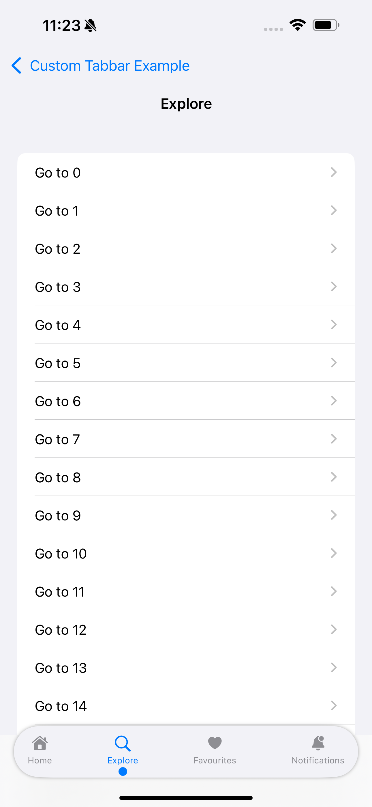

# Custom-Tabbar

This tamplet project demostrate the implementation of common style of custom tabbar with smooth animations, which include 
- Upperline Tabbar
- Floating Dot Tabbar
- Floating Tabbar
- Default/Simple Tabbar

# Screenshots

<table align="center">
  
   <td>
   

https://github.com/user-attachments/assets/737d9ee1-b60d-4bc5-9255-d7cf95f2a9a1

  </td>
  
  <tr>
    <td></td>
    <td style="width: 50px;"></td>
    <td></td>
  </tr>

   <tr>
    <td></td>
    <td style="width: 50px;"></td>
    <td></td>
  </tr>

   <tr>
    <td></td>
    <td style="width: 50px;"></td>
  </tr>
  
</table>
